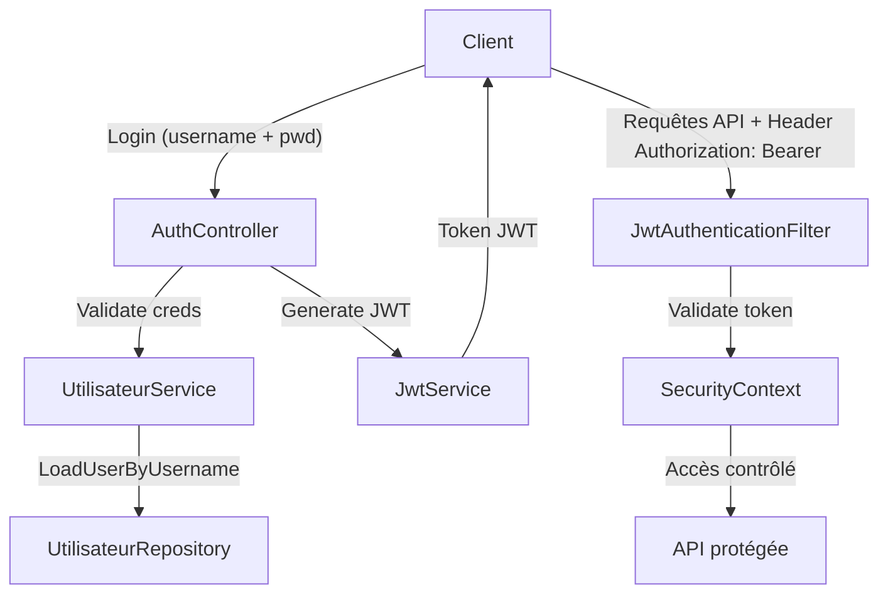

# 🚀 BACKEND-GROUPSMAKER

> Backend Java Spring Boot pour l’application GroupsMaker — gestion sécurisée de listes, personnes et tirages aléatoires.  
> Authentification JWT, rôles utilisateur, et API REST protégée.

---

## 📋 Table des matières

- [Présentation](#-présentation)
- [Fonctionnalités](#-fonctionnalités)
- [Architecture & Sécurité](#-architecture--sécurité)
- [Installation & Setup](#-installation--setup)
- [Configuration](#-configuration)
- [Utilisation & Tests](#-utilisation--tests)
- [Exemples de requêtes cURL](#-exemples-de-requêtes-curl)
- [Bonnes pratiques](#-bonnes-pratiques)
- [FAQ](#-faq)
- [Roadmap](#-roadmap)
- [Contribuer](#-contribuer)
- [Auteur](#-auteur)
- [Licence](#-licence)

---

## 📌 Présentation

GroupsMaker Backend est une API REST sécurisée développée avec Spring Boot.  
Elle permet la gestion de listes personnalisées, d’entités personnes et de tirages aléatoires.  

L’API s’appuie sur un système d’authentification JWT et contrôle l’accès selon les rôles utilisateur (ex: USER, ADMIN).  

---

## ✨ Fonctionnalités

- 🔐 Authentification sécurisée avec JWT  
- 👤 Gestion des utilisateurs avec rôles  
- 📋 CRUD listes, personnes et tirages  
- 🔄 Tirage aléatoire lié à une liste  
- 🚫 Protection des routes par rôles  
- 🗃️ Stockage avec PostgreSQL via JPA/Hibernate  
- 🔧 Configuration facile et extensible  

---

## 🏗 Architecture & Sécurité

### Flux d’authentification JWT



### Sécurité HTTP

- Tous les endpoints `/api/auth/**` sont publics (inscription, connexion).  
- Les autres endpoints exigent un JWT valide.  
- Le filtre `JwtAuthenticationFilter` extrait et valide le token à chaque requête.  
- Les accès sont restreints selon les rôles (`USER`, `ADMIN`).  

---

## 💻 Installation & Setup

### Prérequis

- Java 17+  
- Maven  
- PostgreSQL (configuré et lancé)  

### Cloner le dépôt

```bash
git clone https://github.com/Quentin384/BACKEND-GROUPSMAKER.git
cd BACKEND-GROUPSMAKER
```

### Configuration de la base

Configurer `application.properties` (ou `application.yml`) pour PostgreSQL :

```properties
spring.datasource.url=jdbc:postgresql://localhost:5432/groupsmakerdb
spring.datasource.username=tonuser
spring.datasource.password=tonpassword

spring.jpa.hibernate.ddl-auto=update
spring.jpa.show-sql=true
spring.jpa.properties.hibernate.format_sql=true
```

### Compilation & lancement

```bash
mvn clean install
mvn spring-boot:run
```

L’API est disponible sur : `http://localhost:8080/api`

---

## ⚙️ Configuration

- JWT secret et durée de validité sont configurables dans `application.properties`.  
- Gestion des rôles simple (USER par défaut, ADMIN pour routes protégées).  
- Passwords encodés avec BCrypt (meilleure pratique).  
- Filtrage stateless, sans session côté serveur.  

---

## 🧪 Utilisation & Tests

1. **Inscription**

```bash
curl -X POST http://localhost:8080/api/auth/signup -H "Content-Type: application/json" -d '{"username":"testuser","password":"testpwd"}'
```

2. **Connexion & récupération du token**

```bash
curl -X POST http://localhost:8080/api/auth/login -H "Content-Type: application/json" -d '{"username":"testuser","password":"testpwd"}'
```

Réponse : `eyJhbGciOiJIUzI1NiIsInR5cCI6...` (token JWT)

3. **Appels sécurisés avec token**

```bash
curl -X GET http://localhost:8080/api/listes -H "Authorization: Bearer <token>"
```

---

## 🔥 Exemples de requêtes cURL

- Créer une liste (avec JWT)

```bash
curl -X POST http://localhost:8080/api/listes -H "Content-Type: application/json" -H "Authorization: Bearer <token>" -d '{"nom":"Ma liste importante"}'
```

- Ajouter une personne à une liste

```bash
curl -X POST http://localhost:8080/api/listes/1/personnes -H "Content-Type: application/json" -H "Authorization: Bearer <token>" -d '{"nom":"Dupont","prenom":"Jean"}'
```

- Obtenir tirages d’une liste

```bash
curl -X GET http://localhost:8080/api/listes/1/tirages -H "Authorization: Bearer <token>"
```

---

## ✅ Bonnes pratiques

- Toujours utiliser HTTPS en production  
- Ne jamais exposer les secrets JWT publiquement  
- Stocker les mots de passe uniquement encodés (BCrypt)  
- Protéger les routes sensibles avec des rôles  
- Valider côté backend toutes les données reçues  
- Tester les tokens et la gestion des erreurs  

---

## ❓ FAQ

**Q : Comment obtenir un token JWT ?**  
R : Via l’endpoint `/api/auth/login` avec un couple username/mot de passe valide.

**Q : Que faire si le token expire ?**  
R : Reconnecte-toi via `/api/auth/login` pour obtenir un nouveau token.

**Q : Puis-je changer les rôles des utilisateurs ?**  
R : Oui, via la base de données et en adaptant les rôles dans `SecurityConfig`.

---

## 🚀 Roadmap

- [x] Authentification JWT  
- [x] Gestion utilisateurs et rôles  
- [x] CRUD listes, personnes, tirages  
- [ ] Ajout pagination et filtrage  
- [ ] API Documentation Swagger  
- [ ] Tests unitaires et d’intégration  
- [ ] Notifications en temps réel  

---

## 🤝 Contribuer

Contributions, corrections, suggestions bienvenues !  
Fork, crée une branche, fais tes modifications, puis ouvre une PR.

---

## 📌 Auteur

👨‍💻 Quentin – Étudiant développeur Fullstack Java / Angular  
🎓 Projet réalisé en solo dans le cadre de la formation Simplon, promotion 2025  
🔧 Rôle principal et responsabilités :

- Conception et développement complet du backend et du frontend  
- Implémentation de la logique métier avancée (gestion des groupes, critères personnalisés, tirages)  
- Architecture sécurisée avec JWT, Spring Security et bonnes pratiques REST  
- Développement frontend réactif et responsive avec Angular 19  
- Intégration continue, tests unitaires et gestion des versions  
- Documentation complète et maintien du projet sur GitHub

📅 Période du projet : Mai 2025  
🌐 Contact & suivi : Profil GitHub | LinkedIn 

---

## 📜 Licence

MIT License © 2025 Quentin

---

> *Merci d’avoir consulté ce projet, bon développement !* 👨‍💻🔥